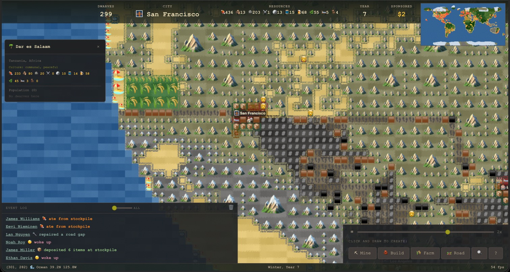

# Dwarf Land

AI-powered civilization simulator. Autonomous dwarves make decisions using tiered AI models (Gemini, Claude, GPT). Built on Cloudflare Workers.



**Live:** [dwarf.land](https://dwarf.land)

## Features

### World
- 2000x1000 emoji tile world map with 125 real-world cities across all continents
- 7 continents with biome-specific terrain (tundra, desert, jungle, mountains, ocean)
- **Wide biome transitions**: 3-pass scatter system (12%/8%/5%) with 8-direction bleed creates organic ~3-tile gradient zones between biomes
- **Forest islands**: noise-based forest clusters naturally dot the plains for visual variety and wood sources
- Terrain speed system with Dijkstra pathfinding (mountains = slow, roads = fast, spatial indexing for O(1) neighbor lookups)
- Auto-generated dirt paths between cities using A* (land-only, no ocean crossing); dwarves upgrade over time
- 4-tier road system: dirt path (👣 free) → gravel (🟫 1 stone) → asphalt (⬛ 2 stone + 1 iron) → railroad (# on ⬛, 3 iron + 2 wood); single-lane rendering, each tier progressively faster
- **Road gap auto-repair**: dwarves detect broken single-lane roads (1-2 tile gaps) within 10 tiles and auto-fix them with a dirt path
- **Smart road upgrades**: dwarves pick upgrade targets that extend the longest unbroken chain of same-type road (chain-scoring algorithm, 15-tile scan radius)
- **Orphan road scrapping**: dwarves detect disconnected road tiles (flood-fill ≤8 tiles, no city/factory connection) and demolish them, recovering stone; scrapped tiles become bare dirt
- **Dirt tile lifecycle**: scrapped roads become bare dirt (🟤 darker brown, slightly slower) that naturally regrows to plains after 1 year
- **Persistent terrain**: all tile changes (builds, farms, roads, mines, designations) saved as deltas and restored on reload
- **Loop Hero rendering**: adjacent same-type terrain tiles grouped into larger squares with scaled emojis (greedy cover, world-aligned for scroll stability)
- **Latitude-aware beaches**: beach umbrella emoji (🏖️) only on tropical/temperate shores (below 45°) adjacent to ocean; high-latitude beaches show clean sand
- **Desert variety**: most desert tiles show plain dark sand (#a8882a); scattered 🌵 (12%), 🪨 (3%), and 🗿 on ocean-adjacent desert shores
- **Shore dithering**: ocean-beach edges get extended pixel dithering for natural coastline transitions; skipped on small inland water bodies
- **Ocean waves**: animated blue shimmer on ocean tiles adjacent to shore, simulating gentle waves
- **Road pulse**: connected road tiles glow with a traveling wave animation; disconnected segments stay static
- **Named graves**: dwarves leave a randomized tombstone (🪦💀☠️⚰️🕯️) with their name permanently on the map; click to see who rests there
- Per-city resources and culturally-named populations
- Cities auto-expand when population and resources allow (beds, stockpiles, tables)
- **Suburbia system**: dwarves with families in crowded cities (pop ≥ 6) build homesteads along roads 8-20 tiles away; suburbs have 4-pop cap, participate in harvest/expansion cycles, and promote to full cities (🏘️) after 2+ seasons with 3+ buildings and 2+ residents; dwarves with children relocate to under-populated suburbs automatically

### Dwarves
- Up to 300 autonomous dwarves with D&D stats (STR/DEX/CON/INT/WIS/CHA)
- Cultural names from 83 real civilizations
- AI-generated backstories and personality traits
- Soul attributes: faith, morality, ambition
- **Sex & reproduction**: dwarves are ♂ or ♀; happy adult pairs (age 20-54, happiness ≥70) produce babies each season if the city has enough food
- **Child state**: newborns (age 0-19) wander near their city, don't work, have reduced hunger/energy drain; become active workers at age 20
- Age system with stat modifiers (young +DEX, elder +WIS, ancient death chance); inspector shows Child/Adult/Elder category
- Carry system: dwarves haul resources back to stockpiles based on STR
- Food sharing: generous dwarves share with hungry neighbors (based on morality + CHA)
- Starvation mechanics: 30-day hunger → immobility → 10-day rescue window → death
- Rescue AI: dwarves carrying food path toward starving city-mates

### Wildlife
- 24 animal species across all biomes: cats, dogs, wolves, bears, eagles, sharks, whales, dolphins, and more
- Up to 400 animals roaming the world simultaneously
- **Ocean animals**: sharks, whales, and dolphins swim freely in ocean tiles with dedicated water movement
- **Terrain-specific spawning**: each species spawns only in matching biomes (penguins in tundra, camels in desert, gorillas in jungle)
- **Combat encounters**: dangerous animals (wolves, bears, sharks) attack nearby dwarves; dwarves fight back using STR
- **Pets**: cats, dogs, and parrots can be tamed by dwarves
- **Hunting**: dwarves gain food from killed animals based on species size
- Eagles soar over mountains and hills; crocodiles lurk in jungles and beaches

### Crafting (Infinite Craft)
- Combine any two items to create new ones (Water + Fire = Steam)
- 296 base items seeded from InfiniteCraftWiki (depth 1-6)
- Unknown combos resolved via AI (Gemini Flash Lite) and cached forever
- Per-dwarf inventory (max 6 craft items)
- Dwarves auto-craft at workshops when idle with 2+ items
- Terrain yields craft ingredients (mining = Earth/Stone, fishing = Water, etc.)

### Trading
- Dwarves from different cities trade when they meet on the same tile
- INT advantage: smarter dwarves get 2:1 deals, equal INT = 1:1 swap (inventory cap enforced)
- Enemy dwarves refuse to trade (relationship system)
- Detailed trade logs show exactly what was exchanged
- 30% trigger chance per meeting to prevent spam

### Vehicles & Transport
- **Horse carts** 🐴: built at cities with wood + cloth; haul goods between nearby cities on dirt paths or better
- **Cars** 🚗: manufactured at factories (iron + wood); faster road transport with larger cargo capacity
- **Trains** 🚂: require railroad tiles; highest capacity bulk transport between connected cities
- **Factories** 🏭: auto-placed near cities with sufficient iron; produce cars once per year
- Dwarves auto-select the best available vehicle for trade routes
- **Passenger transport**: idle dwarves can board passing vehicles for faster travel to other cities; passengers disembark at their destination or ride to the end of the route
- **Autonomous freight**: parked vehicles without drivers autonomously shuttle surplus resources from cities with abundance to cities with shortages, balancing the economy
- Vehicle inspector shows mode (Trade/Freight/Idle) and clickable passenger list

### Ships & Sea Travel
- Coastal cities start with 2 ships; up to 50 ships globally
- Ships built at coastal cities (10 wood + 3 cloth + 2 iron)
- **Ship beaching**: docked ships move onto adjacent land tiles so dwarves can walk to them; ships launch back to water when sailing begins
- **Ocean wildlife**: sharks, whales, and dolphins swim in the ocean (up to 400 animals total)
- 1 captain per ship — sails across ocean to other coastal cities
- Captain sleeps and eats aboard; ship auto-fishes from fish spots
- Cargo system: resources transfer to destination city on arrival
- Ambitious dwarves spontaneously embark on voyages
- Click ships on map to inspect cargo, captain, destination

### UI
- Click inspector for dwarves (stats, inventory, carry, events), cities (ideology), terrain, ships
- **Live inspector**: open panels auto-refresh every 30 ticks — watch stats change in real time
- Follow/lock camera on a specific dwarf with pulsing ring indicator
- **Clickable HUD stats**: all top bar stats are interactive — Dwarves (sortable/filterable population list), City (dropdown switcher), Resources (per-resource city rankings), Year (timeline with past resolutions), Sponsored (sponsored dwarves list)
- City switcher dropdown in top HUD — click city name to jump to any of 125 cities
- City ideology labels computed from aggregate personality (Militant, Spiritual, Mercantile, etc.)
- Contextual Mine/Build/Farm/Road designation buttons with drag-to-designate
- Speed slider (⏸ → 1x → 2x → 5x) for simulation speed control
- Event log with season emoji timestamps (🌱☀️🍂❄️) and rarity filter with consecutive entry collapsing (×N); **all log entries are clickable** — click any event to jump camera to where it happened; dwarf names and city names are individually linkified; hover highlights clickable entries
- **Temperature tinting**: HUD and status bar shift warm amber → cool blue based on camera latitude and season
- **Year resolutions banner**: each new year shows per-city goals (farming, expansion, crafting) based on population stats
- **Graveyard panel**: click fallen count in Year panel to browse all graves; each grave shows cause of death, age, home city, and an AI-generated epitaph (gemini-3.1-flash-lite)
- Footer shows full season + year (e.g. "Autumn, Year 16")
- Clickable minimap: click/tap to jump camera to any location on desktop and mobile
- Splash screen for new visitors + in-game mechanics guide
- Full mobile support: touch pan, pinch-to-zoom (0.75x–3.0x), tap-to-inspect, `touch-action: none` prevents browser gesture interference
- Responsive layout: bottom sheet inspector (12px readable text), collapsible event log (auto-collapses when inspector opens), thumb-zone toolbar
- iOS safe area support, 44px touch targets (close button, slider thumb, drag handle, clickable rows), designation mode with cancel button
- Population sort buttons wrap into 4-column grid on mobile; modals capped at 90vw

### Performance
- BFS pathfinding capped at 2000 steps (covers ~44x44 area)
- Tick stagger: only 1/4 of dwarves compute AI per tick
- Spatial index (8-tile grid buckets) for O(1) neighbor lookups in sharing/trading
- Throttled food search with wander cooldown to prevent BFS spam
- Frame tick cap of 3 prevents lag death spiral
- Tile buffer patching: individual tile changes painted as 1x1 without full re-render (square cover recalculation only on camera move)
- Cached measureText for city labels, hoisted Set constants
- Batch backstory endpoint: 10 dwarves per request, single rate limit check
- Backstory request queue drains every 15s in batches (not individual calls)

### AI
- 4-tier model routing (simple/medium/complex/premium) via OpenRouter
- Fire-and-forget AI calls: game never blocks on responses
- Intent cache: AI decides, cache stores intent, dwarf executes when idle
- Budget hard caps prevent runaway spending ($8.50/hr total)
- In-memory rate limiting per tier

## Sponsorship

Pay to upgrade a dwarf's AI reasoning tier via Polar.sh. Sponsored dwarves get a star badge and make smarter decisions.

| Tier | Price | AI Upgrade | Calls |
|------|-------|------------|-------|
| Bronze | $1 | medium | 100 |
| Silver | $3 | complex | 75 |
| Gold | $10 | premium | 100 |

## Tech Stack

- **Runtime:** Cloudflare Workers (Hono)
- **Database:** Cloudflare D1 (SQLite)
- **AI:** OpenRouter via Vercel AI SDK v6 + Zod v4 schemas
- **Payments:** Polar.sh (@polar-sh/sdk)
- **Frontend:** Vanilla JS canvas + DAUB UI (grunge theme)
- **Tests:** Vitest (405 tests across 23 files)

## Development

```bash
npm install
npm run dev              # local dev server
npm test                 # run 405 tests
npm run test:watch       # vitest watch mode
npm run db:migrate:local # apply D1 migrations locally
npm run db:migrate:remote # apply D1 migrations to production
npm run deploy           # deploy to Cloudflare Workers
```

### Seeding craft data

```bash
npx tsx scripts/import-craft-data.ts     # downloads + generates SQL
npm run db:migrate:local                  # apply locally
npm run db:migrate:remote                 # apply to production
```

## API Endpoints

| Method | Path | Description |
|--------|------|-------------|
| GET | `/api/health` | Budget status per tier |
| POST | `/api/decide/:tier` | AI decision (simple/medium/complex/premium) |
| POST | `/api/backstory` | Generate dwarf backstory |
| POST | `/api/craft` | Combine two items (cache-first, AI fallback) |
| POST | `/api/state/save` | Save game state (includes map deltas) |
| GET | `/api/state/load` | Load game state (restores terrain changes) |
| POST | `/api/sponsor/checkout` | Create Polar checkout session |
| POST | `/api/sponsor/webhook` | Polar webhook handler |
| GET | `/api/sponsor/total` | Total sponsorship revenue |
| GET | `/api/sponsor/status/:dwarfId` | Check sponsorship status |

## Database Migrations

| Migration | Description |
|-----------|-------------|
| `0001_init.sql` | Game state, budget log, AI log tables |
| `0002_sponsorships.sql` | Dwarf sponsorship tracking |
| `0003_crafting.sql` | Craft items + recipes tables |

## Architecture

```
public/index.html      # Game client (canvas, UI, rendering)
public/game-worker.js  # Web Worker simulation (tick loop, AI, pathfinding)
src/worker.ts          # Hono API server
src/ai/router.ts       # Model routing + fallback chains
src/ai/schemas.ts      # Zod v4 schemas for AI output
src/ai/prompts.ts      # Prompt templates per tier
src/ai/fallback.ts     # Local fallback logic (no AI)
src/shared/types.ts    # TypeScript interfaces
src/shared/actions.ts  # Action enums per tier
src/guardrails/        # Budget + rate limiting
src/db/state.ts        # D1 state persistence
migrations/            # D1 SQL migrations
scripts/               # Import/seed scripts
tests/                 # 23 test files, 405 tests
```
